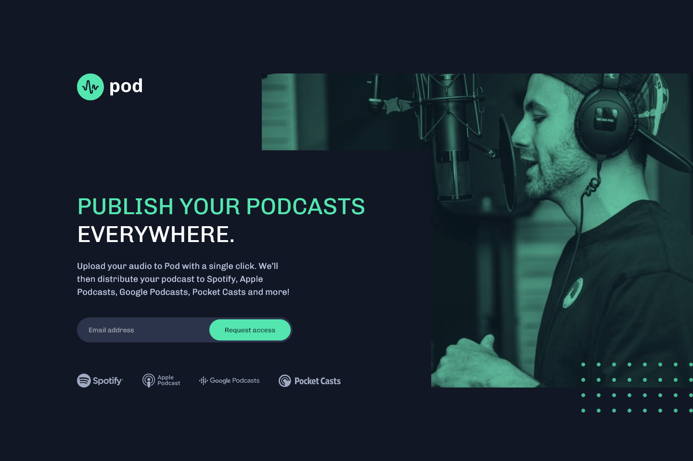

# Frontend Mentor - Pod request access landing page solution

This is a solution to the [Pod request access landing page challenge on Frontend Mentor](https://www.frontendmentor.io/challenges/pod-request-access-landing-page-eyTmdkLSG). Frontend Mentor challenges help you improve your coding skills by building realistic projects.

### Screenshot

### Links

- Solution URL: [Solution URL here](https://github.com/NDK1195/pod-request-access-landing-page)
- Live Site URL: [Live site URL here](https://pod-request-access-landing-page-steel-mu.vercel.app/)

### Built with

- HTML5
- Tailwind CSS
- React
